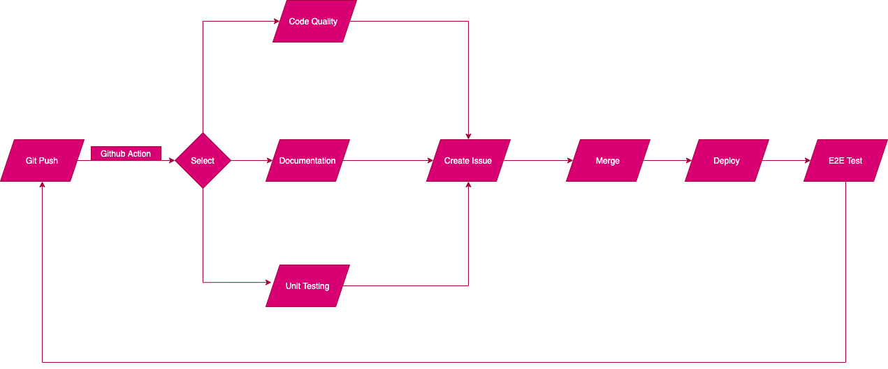

# Detail of the CI/CD Pipeline ##

Here is our continuous integration and development pipeline based on what our team has worked on so far as well as why we made decisions to automate our pipeline this way:

We start by looking at an issue that we create and assign to a specific team on Github. An issue is created either after human review of our current merged code or an issue we come up w/ after Github Actions tasks for automated reviews using various linting, code quality check, testing, and deployment tools which I’ll go over in the next few steps.

Next, to work on an issue, we want to git clone and check out our own working branch and code locally, after which we push to our working branch. No github actions are triggered yet at this moment.

## Event Listening
The first step of the CI/CD Pipeline involves listening to events based on Github Actions. 
Our group mainly focus on four different events in Github: Push, Pull Request Created, Issue Created and Pull Request merged.

## Github Action Workflow
When one of the above events happens, the corresponding github action workflow will be triggered accordingly. Now Github Actions will be run and automate a few checks since it listens to any Github events such as, for example, when we open a pull request to our staging branch.

In our project’s [Actions](https://github.com/cse110-fa21-group11/cse110-sp21-group11/actions) tab we have several workflow runs that will happen based on different GitHub actions like opening a pr or git push/merge.

Our node.js.yml workflow [file](https://github.com/cse110-fa21-group11/cse110-sp21-group11/blob/test-branch/.github/workflows/node.js.yml) is where we automate testing, install test packages, and build eslint for linting check and jsdocs for documentation. 

## Checking Code Quality

Before we can merge our code we have human review through pull requests as well as code quality check using Codacy.

(Using Code Quality Tool)
- At each time a contributor pushes the code, the corresponding Github Action will trigger a code quality check of our project code using [Codacy](https://app.codacy.com/)
- Codacy will use different tools to check for any linting issues/error prone code as well as open pull requests before we can merge our code. 
- We chose Codacy as our code quality check as it is easy to set up and supports all the languages/frameworks. Its UI lays out our coding issues clearly either based on the type of issue or files they’re in. 
- We have automated codacy analysis run using github actions, so the analysis gets updated in codacy through github action everytime we git push code.
- Our dashboard: [Codacy Dashboard](https://app.codacy.com/gh/cse110-fa21-group11/cse110-sp21-group11/dashboard)

(Using Human Review)
- Code quality will also be covered by human review through pull request made, which will also trigger the action that requires our members to review the code.

## EsLint
We chose [ESLint](https://eslint.org/) as our Linting tool. This is also automated in the build part of our node.js.yml workflow [file](https://github.com/cse110-fa21-group11/cse110-sp21-group11/blob/test-branch/.github/workflows/node.js.yml).

## Unit/E2E Testing

We chose [Jest](https://jestjs.io/) to run our unit tests and [Cypress](https://www.cypress.io/) to run our end-to-end tests. Both cypress and jest test runs will be automated through github actions. 

A github action will then run the corresponding unit test. We are planning to run unit tests through automation with Jest. If test runs successfully, we will be able to merge pull request to main, which will be reviewed and if failed, another issue would be created. 

## More Github Actions

After Github Actions and Code Quality Check we can then merge to our main repo and if any issue occurred before that, we would create an issue and work the same workflow again. 

## Documentation

We are using JSDocs for javascript documentation and this is also automated in the build part of our node.js.yml workflow [file](https://github.com/cse110-fa21-group11/cse110-sp21-group11/blob/test-branch/.github/workflows/node.js.yml).

## Deployment
If there are no issues and after merge, we can then deploy our Single Page Application using Netlify. We’ve set it up and here is the URL to visit our deployment:  [Deployment Link](https://he11kitchen.netlify.app/). Our deployment is in a separate workflow run which we are currently working on automating deployment whenever we merge code.

That's the end of our pipeline! Thank you and please check [phase1.png](phase1.png) and [phase1.mp4](phase1.mp4) under cipipeline directory for our pipeline diagram and video explanation.
 

